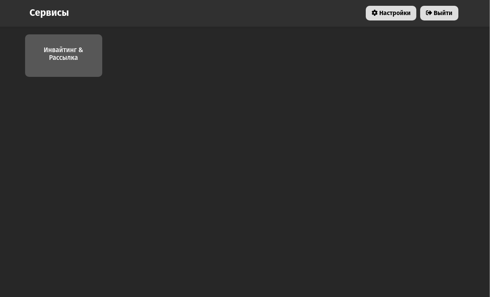

# services-frontend-nextjs

Frontend of a website with services for automating customer acquisition

![NPM][npm-version] ![Node][node-version]

---
## Installation

#### Requirements
* React 
* Node v16.13.2
* Linux, Windows or macOS

#### Installing
```
git clone https://github.com/Services-combine/services-frontend-nextjs.git
cd services-frontend-nextjs   
```

#### Configure
To work, you must create a `.env` file in the main directory of the project and specify such variables as:
```
API_URL - link to the backend api
FOLDER_CHANNELS - the path to the token folder in the backend directory
```

To install all the dependencies, run
```
npm i
```

---
## Build and usage
```
npm run build
npm run start
```


---
## Additionally
A `services_frontend.service` file was also created to run this bot on the server

[npm-version]: https://img.shields.io/static/v1?label=NPM&message=v8.1.2&color=blue
[node-version]: https://img.shields.io/static/v1?label=Node&message=v16.13.2&color=blue