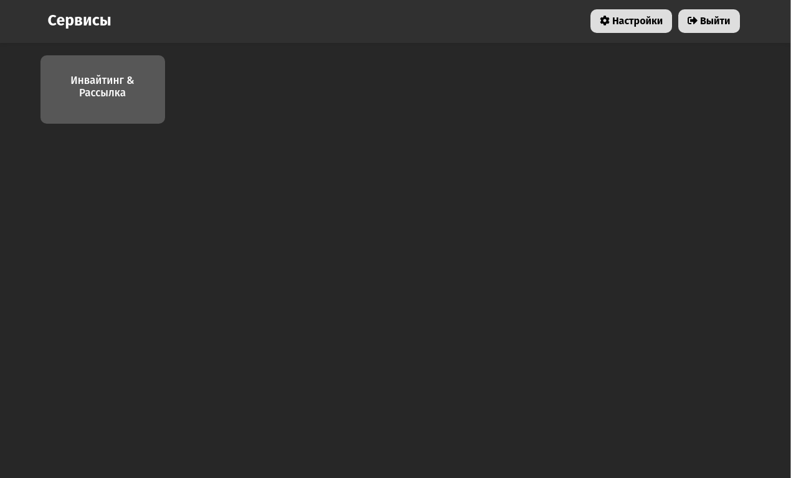

# services-frontend

The client part of the site with advertising and product promotion services. At the moment there is a service for invitations and mailing in telegram. To do this, you will have to add telegram accounts to the site that will perform these functions

![NPM][npm-version] ![Node][node-version]

---
## Installation

#### Requirements
* React 
* Node v16.13.2
* Linux, Windows or macOS

#### Installing
```
git clone https://github.com/Services-combine/services-frontend.git
cd services-frontend   
```

#### Configure
In the file `services-frontend/src/API/index.js` in the `API_URL` variable specify the address of the backend server

To install all the dependencies, run
```
npm -i
```

---
## Usage
```
npm start
```


---
## Additionally
A `services-frontend.service` file was also created to run this bot on the server

[npm-version]: https://img.shields.io/static/v1?label=NPM&message=v8.1.2&color=blue
[node-version]: https://img.shields.io/static/v1?label=Node&message=v16.13.2&color=blue